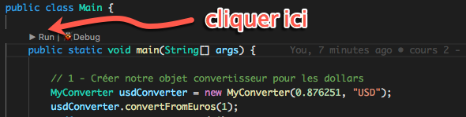

# ca-my-converter

Code academy - Java - Converter project

# Comment le lancer

## Avec VSCODE

https://code.visualstudio.com/

# Cours 2 - Création de mon premier Convertisseur

Notions utilisées:

- Classe vs Objet
- Création de variables
  - De classe
  - de méthode
- Création de méthodes
- Instanciation d'objet (un convertisseur USD et un convertisseur Bitcoin)
- Utilisation de types primitifs
  - String : chaine de caractère "Euros" "USD" ...
  - Chiffre décimale : 2.33 ...
